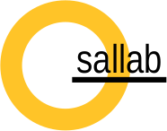

# thesallab.foundation

thesallab.foundation is used by various projects produced by the SaL Lab, e.g. [AllLogger](https://github.com/zhangyin-github/thesallab.alllogger).
## How to build and install
    mvn clean package install
## License
thesallab.configuration is licensed under the MIT license. But please let us
 know if you use thesallab.configuration in your project by sending an email
  to zhangyin(at)mail.neu.edu.cn